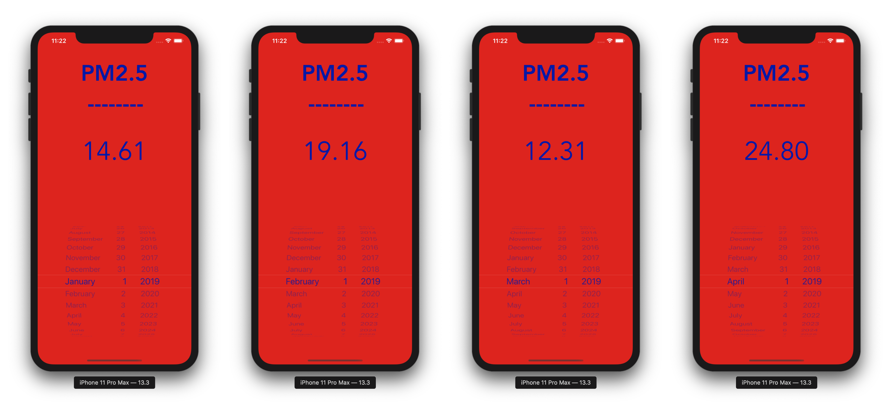

# Build an iOS Application to Predict Air Pollution Using a Random Forest Regressor
> Using Swift, Flask, and sklearn to predict pollution levels on iOS

I'll create a model that can predict the level of small particles on a given day in the city of London and also create a small API that will be consumed by an iOS application.



<!--## Article with full tutorial

* [Medium article with full tutorial](https://medium.com/@omarmhaimdat/licence-plate-reader-ios-application-using-ocr-technologies-and-coredata-3cdee933c38b)-->

## Train the model

MacOS, Linux & Windows:

```sh
python API/train.py
```

## Usage example

Download a large dataset of PM2.5 particles from your hometown for example. (In this repo I used data for London).

Clean up the data and add it to the API folder, make sure to use the column names that I have in my own csv file or you can change the script to fit your `csv` file in `train.py`.

Then you can call use the `train.py` to train the model and save it to the current directory.

Finally, you can predict the PM2.5 particle level by running the Flask API or you can call the prediction function in `predict.py` file.

# Run the API
MacOS, Linux & Windows:

```sh
python API/app.py
```

## API call example

```
http://127.0.0.1:5000/{day}{month}{year}{hour}
```

**January 18, 2020 at 23:00**

```
http://127.0.0.1:5000/1801202023
```

## About me

### Omar MHAIMDAT:

**Linkedin:** [Linkedin profile](https://www.linkedin.com/in/omarmhaimdat/)

**Email:** omarmhaimdat@gmail.com

Distributed under the MIT license. See ``LICENSE`` for more information.

## Other projects

### Face detection and recognition with CoreML and ARKit

* [Github Repo](https://github.com/omarmhaimdat/WhoAreYou)

* [Medium article with full tutorial](https://medium.com/@omarmhaimdat/face-detection-and-recognition-with-coreml-and-arkit-8b676b7448be?source=friends_link&sk=c34c61b820f749862eca97cc63dc518c)

### Creating a License Plate Reading iOS Application Using OCR Technologies and CoreData

* [Github Repo](https://github.com/omarmhaimdat/WhereAreYouFrom)

* [Medium article with full tutorial](https://medium.com/@omarmhaimdat/licence-plate-reader-ios-application-using-ocr-technologies-and-coredata-3cdee933c38b)

### Using Core ML and Natural Language for Sentiment Analysis on iOS

* [Github Repo](https://github.com/omarmhaimdat/SentimentAnalysisApp)

* [Medium article with full tutorial](https://heartbeat.fritz.ai/using-core-ml-and-natural-language-for-sentiment-analysis-on-ios-d9469ce6c0ef)

### Building a Sound Classification iOS Application using AI

* [Github Repo](https://github.com/omarmhaimdat/SoundClassifier)

* [Medium article with full tutorial](https://heartbeat.fritz.ai/building-a-sound-classification-ios-application-using-ai-1655506d1763)